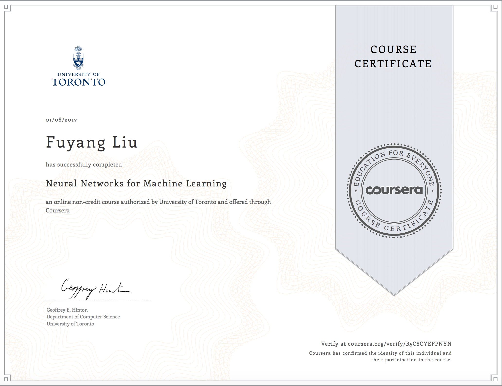

# Neural Networks for Machine Learning 
University of Toronto

## About this Course
Learn about artificial neural networks and how they're being used for machine learning, as applied to speech and object recognition, image segmentation, modeling language and human motion, etc. We'll emphasize both the basic algorithms and the practical tricks needed to get them to work well.

This course contains the same content presented on Coursera beginning in 2013. It is not a continuation or update of the original course. It has been adapted for the new platform. 

Please be advised that the course is suited for an intermediate level learner - comfortable with calculus and with experience programming (Python).

## Syllabus

* Week 1 - Introduction to the course - machine learning and neural nets 

* Week 2 - The Perceptron learning procedure. An overview of the main types of neural network architecture

* Week 3 - The backpropagation learning proccedure. Learning the weights of a linear neuron 

* Week 4 - Learning feature vectors for words

* Week 5 - Object recognition with neural nets.

* Week 6 - Optimization: How to make the learning go faster. We delve into mini-batch gradient descent as well as discuss adaptive learning rates

* Week 7 - Recurrent neural networks

* Week 8 - More recurrent neural networks

* Week 9 - Ways to make neural networks generalize better

* Week 10 - Combining multiple neural networks to improve generalization

* Week 11 - Hopfield nets and Boltzmann machines

* Week 12 - Restricted Boltzmann machines (RBMs)

* Week 13 - Stacking RBMs to make Deep Belief Nets

* Week 14 - Deep neural nets with generative pre-training

* Week 15 - Modeling hierarchical structure with neural nets

* Week 16 - Recent applications of deep neural nets
